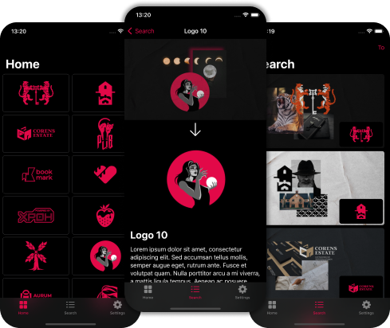
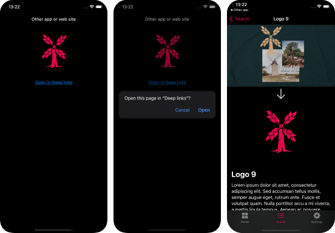

# ``DeepLinks``

An application to present the possibility of deep links.

## Overview

DeepLinks is an iOS app that show how deep links work.

Logos from the [logofolio 2022 vol.4](https://www.behance.net/gallery/143328369/Logofolio-2022-vol4) by [Vladislav Novitsky](https://www.behance.net/Nowwhiskey) were used as content.

It shows how the transition from other app or web site to an application to a specific screen takes place.

<!--
### Documentation

[DocC](https://sertrsv.github.io/DeepLinks/documentation/DeepLinks)

## Topics

### App

- ``DeepLinksApp``

### Model

- ``Logo``

### ViewModel

- ``ModelData``

### Views

- ``ContentView``
- ``HomeView``
- ``SearchView``
- ``SettingsView``

### Previews

- ``ContentView_Previews``
- ``HomeView_Previews``
- ``SearchView_Previews``
- ``SettingsView_Previews``
-->
